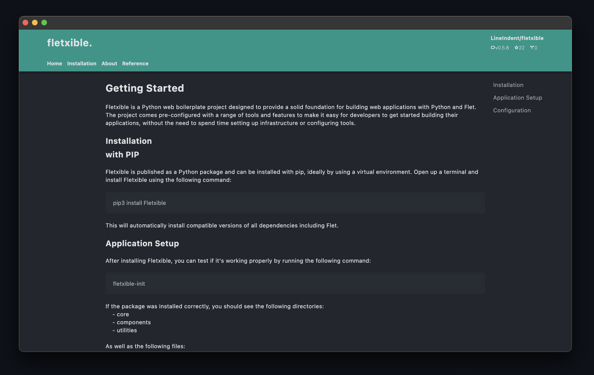

<h1 align="center" style="font-size: 5em; font-weight: 100;">fletxible.</h1>


<div align="center">
  <a href="https://github.com/LineIndent/fletxible/actions/workflows/build.yml">
    
  </a>
  <!-- <a href="https://fletxible.readthedocs.io/en/latest/?badge=latest">
    
  </a> -->
  <!-- <a href="https://pypi.org/project/fletxible/">
    
  </a> -->
  <a href="https://pypi.org/project/Fletxible/">
    
  </a>
  <a href="https://pypi.org/project/fletxible/">
    
  </a>
</div>

<br>

<p align="center">
Fletxible is a Python web boilerplate project designed to provide a solid foundation for building web applications with Python and Flet. The project comes pre-configured with a range of tools and features to make it easy for developers to get started building their applications, without the need to spend time setting up infrastructure or configuring tools.</p>




## Installation

To use Fletxible, you need to have the following installed:

-   Latest version of Flet
-   Python 3.5+

If you don't have Flet installed, installing Fletxible automatically installs it for you. You can install Fletxible using the following command:
```py
$ pip install Fletxible
```


## Application Setup

After installing Fletxible, you can test if it's working properly by running the following command:

```py
$ fletxible-init
```

If the package was installed correctly, a file called ```fx_config.yml``` will be generated inside the root directory. Other directories and files will also be generated.

## 3. Quick Start

Open the  ```fx_config.yml``` file and configure the document as needed. Change the site name, repository link, as well as any theme related settings.

When you're ready, run the following command to generate your files/pages:
```py
python3 script.py
```

If successful, the script should generate files inside a directory named ```web``` corresponding to the names under the **navigation** header inside the ```fx_config.yml```. 

You can then run the following command to see your application:

```py
python3 main.py
```

If the setup has no error, you can start customizing your pages by adding in your personal layout directly within the generated pages inside the ```web``` directory.


## Current Algorithm Functions

This algorithm is a script that loads and processes data from a YAML file ```flet_config.yml``` that contains navigation information for a web application. The script then updates and creates various files and directories necessary for the application to function.

Here is a summary of what the algorithm does (v0.2.0):

1. Import necessary libraries and functions
2. Define a dictionary variable to hold route keys

3. Define several functions to perform various tasks:
   1. open_yaml_script(): Loads data from the "fx_config.yml" file.
   2. check_pages_directory_script(): Checks if a "pages" directory exists and creates one if not.
   3. update_pages_directory_script(docs: dict): Loops over the files in the "pages" directory and deletes any files that are not listed in the navigation information.
   4. handle_navigation_routing_script(docs: dict): Loops over the navigation information and writes route strings to a temporary file.
   5. set_application_routing_script(docs: dict): Reads the temporary file created in the previous step, creates a route.py file with the appropriate routes, and deletes the temporary file.
   6. set_default_methods_script(docs: dict): Loops over the navigation information and creates default pages for each page listed, and creates a route.pickle file with information about the modules used in the application. 
   7. map_yaml(yaml_file_path, output_file_path): Reads a YAML file and writes its contents to a Python file with a specified filename.
   8. script(page: ft.Page): Main function that calls the other functions to process the data and set up the application.

Overall, the script is part of a larger application development process that involves reading and processing data from a YAML file, creating and updating various files and directories, and setting up routing information for a web application.

## Contributing

Contributions are highly encouraged and welcomed.


## License

Fletxible is open-source and licensed under the [MIT License](LICENSE).